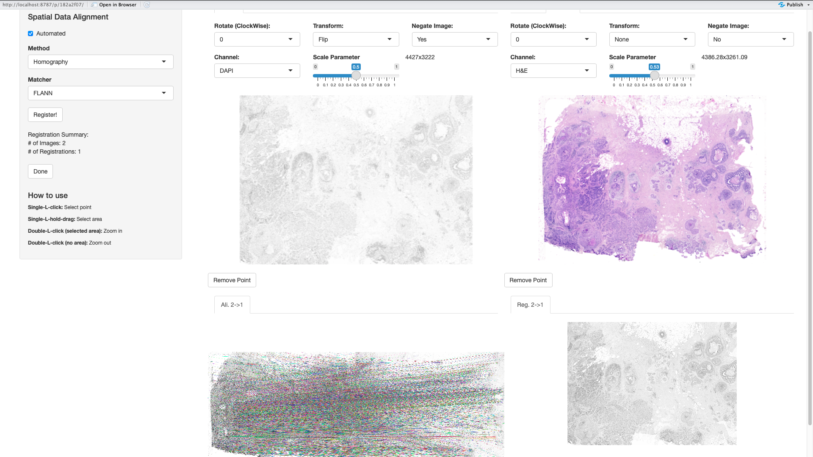
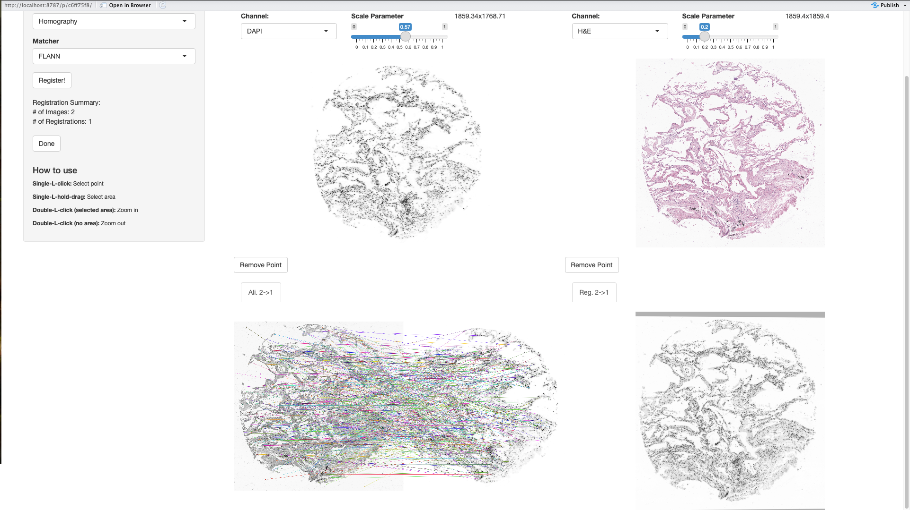
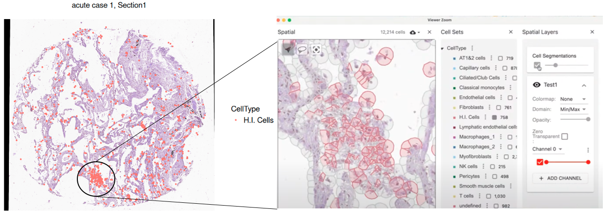
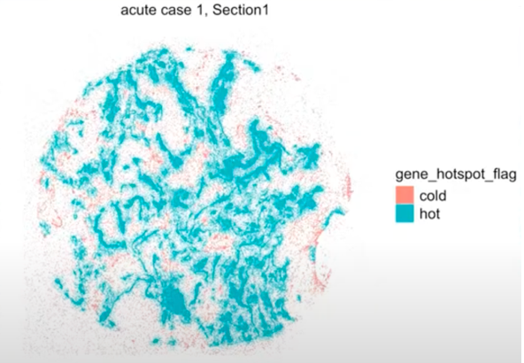

<nav style="background-color: #f8f9fa; padding: 10px; font-family: sans-serif; border-bottom: 1px solid #ddd; display: flex; justify-content: space-between; align-items: center;">

::: {style="text-align: left;"}
<a href="../index.html" style="text-decoration: none;">Back to Note</a>
:::

::: {style="text-align: center;"}
<a href="https://github.com/Dewey-Wang/Compgen-2025" target="_blank" style="text-decoration: none;">
View on GitHub</a>
:::

</nav>

```{=html}
<style>
.center {
  display: flex;
  justify-content: center;
  align-items: center;
  text-align: center;
}
</style>
```

# Description

This R Markdown document demonstrates how to:

-   Perform **image registration** to align transcriptomic and
    histological data.
-   Integrate **cell-level and molecule-level spatial transcriptomics**
    (Xenium).
-   Combine **tissue morphology** from H&E with **molecular insights**
    to study spatial infection patterns in COVID-19 lungs.

We will use:

-   Xenium breast cancer dataset with accompanying H&E image.
-   A Xenium COVID-19 lung dataset with annotated hyaline membrane
    regions and SARS-CoV-2 viral RNAs (`S2_N`, `S2_orf1ab`).

> If you want to reproduce the experiment: 👉 [Click here to the Docker
> and the data setup instructions](#environment--dataset-setup)

## Description of the Files

-   `Xen_R1`: Processed Xenium object of breast cancer section (cells).
-   `Xen_R1_image`: Corresponding H&E image.
-   `vr2_merged_acute1`: COVID-19 Xenium dataset with both **cells** and
    **molecules** (`Xenium` and `Xenium_mol`).
-   `acutecase1_membrane.geojson`: Annotated hyaline membrane regions.
-   `acutecase1_heimage.jpg`: H&E image of lung tissue.

```{r setup, include=FALSE}
options(java.parameters = "-Xmx8g")
knitr::opts_chunk$set(echo = TRUE)
```

------------------------------------------------------------------------

# Load Required Libraries

```{r load-libraries, message=FALSE}
library(VoltRon)
library(dplyr)
library(Seurat)
library(ComplexHeatmap)
library(basilisk)
library(vitessceR)
library(ggnewscale)
```

------------------------------------------------------------------------

# Image Registration – Xenium Breast Cancer Dataset

## Why Image Registration?

Spatial transcriptomics often captures DAPI-based coordinates, while
histology gives tissue context (e.g., H&E). Registration bridges these
layers. These integrated features enables **morphology-guided cell
analysis**:

For example:

-   Cell localization within tissue landmarks
-   Detection of tumor margins, immune cell hotspots, etc.

## Import Data

```{r, eval = FALSE}
Xen_R1 <- loadVoltRon("../workshop/data/ondisk/Xen_R1/")
```

We store them on disk using an HDF5VoltRon format. Disk-backed formats
allow us to analyze large spatial datasets without crashing R due to
memory limits.

```{r, eval = FALSE}
Xen_R1_image <- importImageData("../workshop/data/BreastCancer/Xenium_R1/Xenium_FFPE_Human_Breast_Cancer_Rep1_he_image_highres.tif",
                                sample_name = "HEimage",
                                channel_names = "H&E", tile.size = 100)
Xen_R1_image_disk <- saveVoltRon(Xen_R1_image, 
                                 format = "HDF5VoltRon", 
                                 output = "../data/ondisk/Xen_R1_image/", 
                                 replace = TRUE)

# load H&E data from disk
Xen_R1_image_disk <- loadVoltRon("../data/ondisk/Xen_R1_image/")

```

### Perform Registration

We now perform automated image registration. Behind the scenes, this
detects features (e.g., nuclei, shapes) and applies homography to align
two spatial maps.

```{r, eval = FALSE}
xen_reg <- registerSpatialData(object_list = list(Xen_R1, Xen_R1_image_disk)) # This will give you a interface to do the registration for two images like below
```



We then transfer the aligned image and visualize the clusters overlayed
on H&E.

```{r, eval = FALSE}
Xenium_reg <- xen_reg$registered_spat[[2]]
vrImages(Xen_R1[["Assay1"]], channel = "H&E") <- vrImages(Xenium_reg, name = "main_reg", channel = "H&E")
vrSpatialPlot(Xen_R1, group.by = "Clusters", channel = "H&E")
```

```{r, echo=FALSE, fig.align='center', fig.width=5, fig.height=4}
Xen_R1 <- readRDS("./RDS/Xen_R1_1.rds")
vrSpatialPlot(Xen_R1, group.by = "Clusters", channel = "H&E")
```

------------------------------------------------------------------------

# Multi-omics Integration – COVID-19 Lung

## Biological Background

COVID-19 lungs contain viral RNAs (`S2_N`, `S2_orf1ab`), some inside
cells, some in **hyaline membrane** regions (mucosal damage zones). We
analyze:

-   **Cell types**: Immune and structural cells.
-   **Molecules**: Viral RNA transcripts.

## Biological Question

We study:

-   Which cells (e.g., immune, stromal) are present in COVID-affected
    lung
-   Where viral RNA molecules (e.g., S2_N, ORF1ab) appear
-   How spatial location (e.g., hyaline membrane) modulates infection

## Import Xenium Object

```{r}
vr2_merged_acute1 <- readRDS(file = "../workshop/data/COVID19/acutecase1_annotated.rds")
SampleMetadata(vr2_merged_acute1)
```

## Visualize Cells & Molecules

Xenium captures not only transcripts within cells but also those outside
the cells. They use DAPI staining to mark the boundary and calculate the
transcripts within the cells to get the Cell assay. This allows Xenium
to provide Cell assay and Molecule assay. This feature provides a more
comprehensive understanding of spatial transcriptomics.

```{r, fig.align='center', fig.width=15, fig.height=4, dev='png'}
# Cells
p1 <- vrSpatialPlot(vr2_merged_acute1, assay = "Xenium", group.by = "CellType", plot.segments = TRUE)

# Molecules
p2 <- vrSpatialPlot(vr2_merged_acute1, assay = "Xenium_mol", group.by = "gene", group.ids = c("S2_N", "S2_orf1ab"), n.tile = 500)

p3 <- vrSpatialPlot(vr2_merged_acute1, assay = "Xenium_mol", group.by = "gene", group.ids = c("S2_N", "S2_orf1ab"), n.tile = 500) |>
  addSpatialLayer(vr2_merged_acute1, assay = "Xenium", group.by = "CellType", plot.segments = TRUE)
(p1 | p2 | p3)
```

> 💬 *Explanation:* Molecules often lie **outside cells**, particularly
> in damaged zones, making tissue morphology crucial for interpretation.

------------------------------------------------------------------------

# H&E Alignment with ROI

## Import & Register H&E Image

We load an H&E image annotated by a pathologist for **hyaline
membranes**. These are regions of epithelial damage.

After registration, we register the image and its annotations to our
main dataset.

```{r, eval = FALSE}
imgdata <- importImageData("../workshop/data/COVID19/acutecase1_heimage.jpg", tile.size = 10,
                           segments = "../workshop/data/COVID19/acutecase1_membrane.geojson", sample_name = "acute case 1 (HE)",
                           channel_names = "H&E")
imgdata <- flipCoordinates(imgdata, assay = "ROIAnnotation")
vr2_merged_acute1 <- modulateImage(vr2_merged_acute1, brightness = 300)
xen_reg <- registerSpatialData(object_list = list(vr2_merged_acute1, imgdata)) # This will have interface like below
```



## Transfer Image and ROI

```{r, eval = FALSE}
imgdata_reg <- xen_reg$registered_spat[[2]]
vrImages(vr2_merged_acute1[["Assay7"]], name = "main", channel = "H&E") <- vrImages(imgdata_reg, assay = "Assay1", name = "main_reg")
vrImages(vr2_merged_acute1[["Assay8"]], name = "main", channel = "H&E") <- vrImages(imgdata_reg, assay = "Assay1", name = "main_reg")

# Add ROI Assay
vr2_merged_acute1 <- addAssay(vr2_merged_acute1,
                              assay = imgdata_reg[["Assay2"]],
                              metadata = Metadata(imgdata_reg, assay = "ROIAnnotation"),
                              assay_name = "ROIAnnotation",
                              sample = "acute case 1", layer = "Section1")
vrMainSpatial(vr2_merged_acute1[["Assay9"]]) <- "main_reg"
vrMainAssay(vr2_merged_acute1) <- "ROIAnnotation"
vr2_merged_acute1$Region <- "Hyaline Membrane"

p1 <- vrSpatialPlot(vr2_merged_acute1, assay = "Xenium_mol", group.by = "gene", 
              group.ids = c("S2_N", "S2_orf1ab"), n.tile = 500) |>
  addSpatialLayer(vr2_merged_acute1, assay = "ROIAnnotation", 
                  group.by = "Region", alpha = 0.3, spatial = "main_reg",
                  colors = list(`Hyaline Membrane` = "blue")) 
p2 <- vrSpatialPlot(vr2_merged_acute1, assay = "ROIAnnotation", 
              group.by = "Region", alpha = 0.3, spatial = "main_reg",
              colors = list(`Hyaline Membrane` = "blue"))
(p1 | p2)
```

```{r, echo=FALSE, fig.align='center', fig.width=10, fig.height=3, dev='png'}
vr2_merged_acute1 <- readRDS("./RDS/vr2_merged_acute1_1.rds")
p1 <- vrSpatialPlot(vr2_merged_acute1, assay = "Xenium_mol", group.by = "gene", 
              group.ids = c("S2_N", "S2_orf1ab"), n.tile = 500) |>
  addSpatialLayer(vr2_merged_acute1, assay = "ROIAnnotation", 
                  group.by = "Region", alpha = 0.3, spatial = "main_reg",
                  colors = list(`Hyaline Membrane` = "blue")) 
p2 <- vrSpatialPlot(vr2_merged_acute1, assay = "ROIAnnotation", 
              group.by = "Region", alpha = 0.3, spatial = "main_reg",
              colors = list(`Hyaline Membrane` = "blue"))
(p1 | p2)
```

------------------------------------------------------------------------

# Transfer ROI to Molecule Data

To assess whether molecules are enriched in hyaline membrane zones. This
allows us to **tag each molecule** with the region it resides in —
helping quantify infection by zone.

```{r, eval = FALSE}
vrSpatialNames(vr2_merged_acute1, assay = "all")
vrMainSpatial(vr2_merged_acute1[["Assay9"]]) <- "main_reg"
vr2_merged_acute1 <- transferData(object = vr2_merged_acute1, 
                                  from = "Assay9", 
                                  to = "Assay8", 
                                  features = "Region")
```

## Summary of Molecule Counts

```{r, eval = FALSE}
s2_summary_hyaline <- Metadata(vr2_merged_acute1, assay = "Xenium_mol") %>%
  filter(gene %in% c("S2_N", "S2_orf1ab"), Region == "Hyaline Membrane") %>%
  summarise(S2_N = sum(gene == "S2_N"), 
            S2_orf1ab = sum(gene == "S2_orf1ab"), 
            ratio = sum(gene == "S2_N")/sum(gene == "S2_orf1ab")) %>% 
  as.matrix()
s2_summary_hyaline
```

```{r, echo=FALSE}
s2_summary_hyaline <- readRDS("./RDS/s2_summary_hyaline.rds")
s2_summary_hyaline
```

> 🧠 **Interpretation**: `S2_N / S2_orf1ab` ratio informs us about **viral replication**. A higher ratio indicates more **active replication**.

------------------------------------------------------------------------

# Interactive Visualization

Convert to AnnData/Zarr for `vitessce` or `rolv` visualization.

```{r, eval = FALSE}
## Use can use Rstduio locally, You can use this function.
as.AnnData(vr2_merged_acute1, assay = "Assay7", file = "../workshop/data/ondisk/COVID19/vr2_merged_acute1_annotated_registered.zarr", 
           flip_coordinates = TRUE, create.ometiff = TRUE, name = "main", channel = "H&E")


# If you use Docker, use this function! But the function may not as flexible as the function above
# vrSpatialPlot(vr2_merged_acute1, assay = "Xenium",channel = "H&E", group.by = "CellType", interactive = TRUE)
```



------------------------------------------------------------------------

# Region-Based Comparison

Using interactive annotation, define **infected zones** and compare with
hyaline membranes.

```{r, eval = FALSE}
# Manually annotate infected zones
vr2_merged_acute1 <- annotateSpatialData(vr2_merged_acute1, assay = "Xenium_mol", label = "Region2", 
                                         use.image = TRUE, channel = "H&E", annotation_assay = "InfectedAnnotation")
# The functionwill give you GUI interface. I use GIF for demo here
```

::: center
<video width="80%" controls>

<source src="images/2025-04-0411.05.10-ezgif.com-video-speed.mov" type="video/mp4">

Your browser does not support the video tag.

</source>

</video>
:::

## Integrate with other layers

```{r, echo=FALSE}
vr2_merged_acute1 <- readRDS("./RDS/vr2_merged_acute1_3.rds")
```

```{r, fig.align='center', fig.width=5, fig.height=3, dev='png'}
vrSpatialPlot(vr2_merged_acute1, assay = "Xenium_mol", group.by = "gene", 
              group.ids = c("S2_N", "S2_orf1ab"), n.tile = 500) |>
  addSpatialLayer(vr2_merged_acute1, assay = "ROIAnnotation", group.by = "Region", alpha = 0.3, spatial = "main_reg",
                  colors = list(`Hyaline Membrane` = "blue")) |>
  addSpatialLayer(vr2_merged_acute1, assay = "InfectedAnnotation", group.by = "Region2", alpha = 0.8, 
                  colors = list(`Infected` = "yellow"))
```

```{r, eval = FALSE}
# Compare abundance
s2_summary_infected <- 
  Metadata(vr2_merged_acute1, assay = "Xenium_mol") %>%
  filter(gene %in% c("S2_N", "S2_orf1ab"), 
         Region2 == "Infected") %>% 
  summarise(S2_N = sum(gene == "S2_N"), 
            S2_orf1ab = sum(gene == "S2_orf1ab"), 
            ratio = sum(gene == "S2_N")/sum(gene == "S2_orf1ab")) %>% 
  as.matrix()

rbind(s2_summary_infected, s2_summary_hyaline)
```

```{r, echo=FALSE}
s2_summary_infected <- readRDS("./RDS/s2_summary_infected.rds")
s2_summary_hyaline <- readRDS("./RDS/s2_summary_hyaline.rds")

rbind(s2_summary_infected, s2_summary_hyaline)
```

```{r}
# check all abundances
S2_table <- matrix(c(s2_summary_hyaline[,1:2], 
                     s2_summary_infected[,1:2]), 
                   dimnames = list(Region = c("Hyaline", "Infected"), 
                                   S2 = c("N", "orf1ab")),
                   ncol = 2,  byrow = TRUE)
fisher.test(S2_table, alternative = "two.sided")
```

------------------------------------------------------------------------

# Hotspot Analysis

Identify **regions of high local molecule enrichment** using spatial
graph statistics.

```{r, eval = FALSE}
vr2_merged_acute1 <- getSpatialNeighbors(vr2_merged_acute1, assay = "Xenium_mol", 
                                         group.by = "gene", group.ids = c("S2_N", "S2_orf1ab"),
                                         method = "radius", radius = 50)

vr2_merged_acute1 <- getHotSpotAnalysis(vr2_merged_acute1, assay = "Xenium_mol", 
                                        features = "gene", graph.type = "radius")
                                        
vrSpatialPlot(vr2_merged_acute1, assay = "Xenium_mol", 
              group.by = "gene_hotspot_flag", group.ids = c("cold", "hot"), 
              alpha = 1, background.color = "white")
```

::: center

:::

------------------------------------------------------------------------

# Summary

This pipeline illustrates how **integrating multiple spatial data
types** can enhance biological insight:

-   **Image registration** aligns cells and morphology.
-   **ROI annotation** enables pathology-informed molecular analysis.
-   **Multi-layer visualization** reveals complex infection patterns.
-   **Ratio analysis** and **hotspot detection** highlight viral
    activity and tissue damage zones.

Together, they provide a powerful framework for spatial biology and
disease pathology studies.

------------------------------------------------------------------------

# Environment & Dataset Setup {#environment--dataset-setup}

## Run RStudio in Docker

Use a pre-built Docker image with VoltRon and all dependencies
pre-installed.

1.  Make sure [Docker
    Desktop](https://www.docker.com/products/docker-desktop) is
    installed.

2.  Pull the image:

``` bash
docker pull amanukyan1385/rstudio-voltron:main
```

3.  Start the container:

``` bash
docker run --rm -ti \
  -e PASSWORD=yourpassword \
  -p 8787:8787 \
  -v Path/to/your/dataset:/home/rstudio/project \
  amanukyan1385/rstudio-voltron:main
```

4.  Access RStudio:\
    <http://localhost:8787>
    -   Username: `rstudio`
    -   Password: `yourpassword` \# you can change your own password

You can also use Docker Desktop GUI if you prefer volume mounting.

------------------------------------------------------------------------

## Datasets

Download the complete dataset bundle used in this notebook:

[**Download all datasets (ZIP)**](#0) **- including datasets for other
markdown**

------------------------------------------------------------------------

### Original Dataset Sources

-   **Xenium – COVID-19 Lung**
    -   [Annotated
        RDS](https://bimsbstatic.mdc-berlin.de/landthaler/VoltRon/Multiomics/acutecase1_annotated.rds)
-   **Visium CytAssist – Breast Cancer**
    -   [Dataset](https://www.10xgenomics.com/products/xenium-in-situ/preview-dataset-human-breast)

------------------------------------------------------------------------

<nav style="background-color: #f8f9fa; padding: 10px; font-family: sans-serif; border-bottom: 1px solid #ddd; display: flex; justify-content: space-between; align-items: center;">

::: {style="text-align: left;"}
<a href="../index.html" style="text-decoration: none;">Back to Note</a>
:::

::: {style="text-align: center;"}
<a href="https://github.com/Dewey-Wang/Compgen-2025" target="_blank" style="text-decoration: none;">
View on GitHub</a>
:::

</nav>
