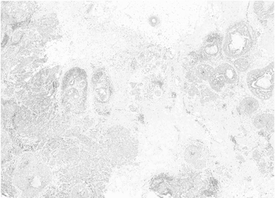
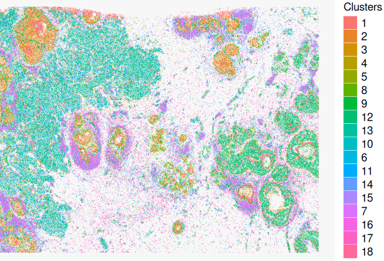
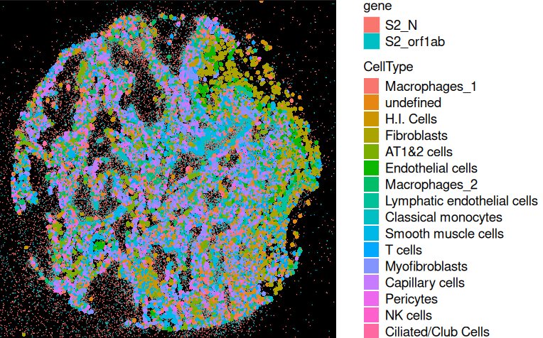
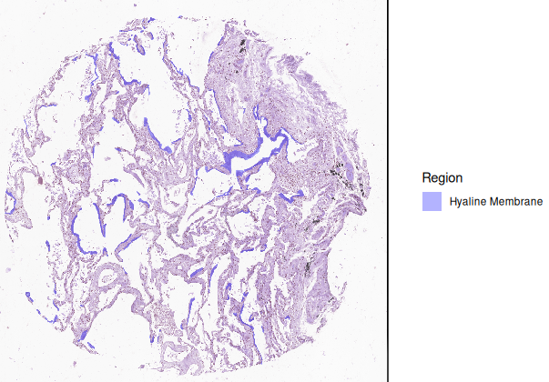
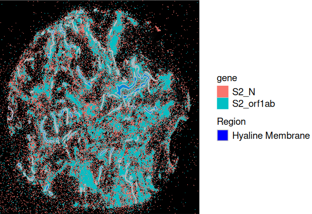

```{r, echo=FALSE}
```

# 1. Image Registration

In the previous notes, I mentioned that there are different types of spatial omics data, including spatial transcriptomics and histology images. Through image registration, spatial transcriptomics data can be aligned with histology images, enabling multi-modal integration by linking molecular and morphological features.

This process helps interpret transcriptomics data in the context of tissue structure and supports automated region segmentation and pathology-guided analysis.

# 2. Methods of Image Registration

## 2.1. Automated Registration

Step 1. Keypoint detection/selection (e.g., SIFT)

Step 2. Descriptor Matching (e.g., FLANN-based matching)

Step 3. Homography transformation (e.g., RANSC)

Efficient for large-scale datasets but may require fine-tuning.

## 2.2. Manual Alignment

Step 1. Manually Keypoint selection

Step 2. Homography transformation (e.g., TPS)

Ensures accurate alignment when automated methods fail.

### Exsamples

::: {.center-images layout-ncol="2"}
{width="296"}

{width="292"}
:::


::: {.center-images layout-ncol="2"}
{width="277"}

{width="322"}
:::

# 3. Spatial Multiomics Integration

In the previous notes, I mentioned that Xenium captures not only transcripts within cells but also those outside the cells. This allows Xenium to provide Cell assay and Molecule assay. This feature provides a more comprehensive understanding of spatial transcriptomics.

However, while we can detect molecules outside the cells, we do not know what they are interacting with. To address this, we need tissue morphology information. Here, we use COVID-19-infected lung tissue as an example.

::: {.center-images layout-ncol="1"}
{width="461"}
:::

In the sample, the ORF1AB gene is present in template viral RNA, while the N gene is found in replicating viral RNA. By analyzing the N/ORF1AB gene ratio, we can determine whether the virus is actively replicating.

To incorporate tissue morphology, we use H&E images, where pathologists annotate healing membrane regions. By integrating healing membrane annotations with the molecule assay, we can study whether the virus is active in these regions.

::: {.center-images layout-ncol="2"}
{width="412"}

{width="457"}
:::

# Supplementary Notes

To extract more information from images, interactive exploration tools can be used.

For example: Convert Anndata into Zarr format and use VoltRon for an interactive visualization system

::: left-align
[Previous](Spatial_Transcriptomics_Analysis.qmd)
:::
