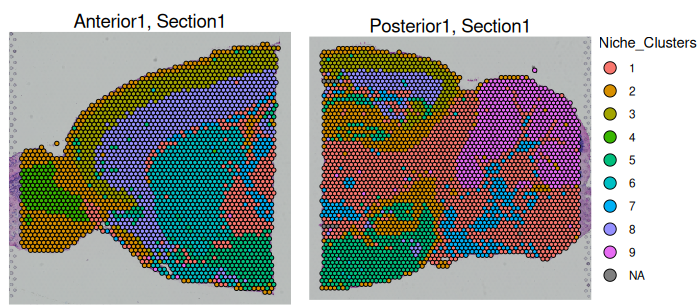
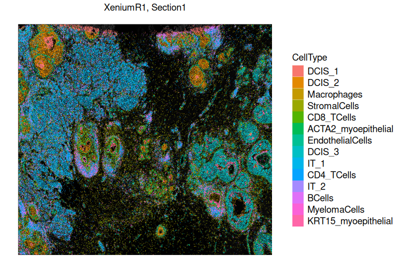
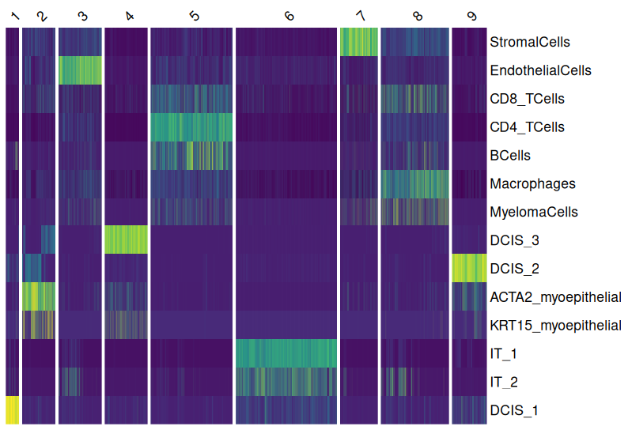
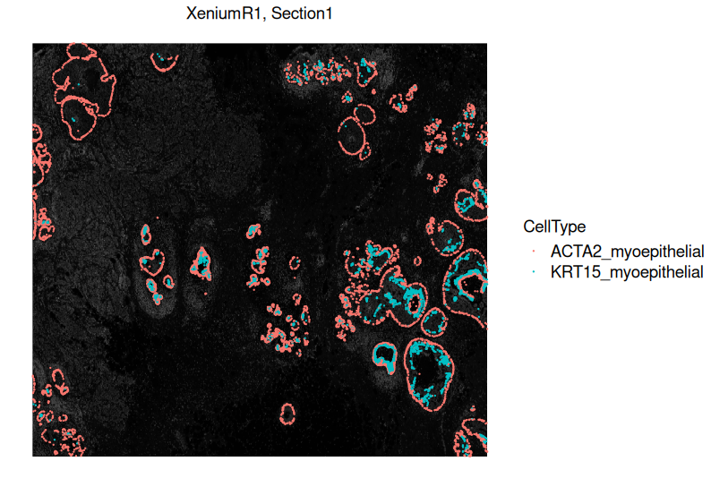
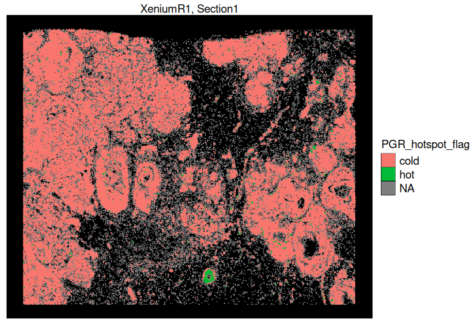

```{r, echo=FALSE}
```

# 1. Types of Spatial Omics Data

Spatial omics data varies in resolution and scope, offering diverse perspectives on tissue biology:

-   Cells: Gene expression profiles of individual cells with spatial coordinates, providing single-cell resolution (e.g., Xenium, Merfish data).
-   Spots: Predefined areas on a slide capturing gene expression, often encompassing multiple cells (e.g., Visium spots).
-   Regions of Interest (ROIs): User-selected tissue areas for targeted analysis, typically larger than cells, based on morphological or functional significance.
-   Molecules: Subcellular detection of individual RNA molecules, offering the highest resolution.(e.g., Xenium, Merfish data)
-   Images: Visual data (e.g., H&E or DAPI-stained slides) providing morphological context for molecular data.

Each spatial omics data could provide different point of view and allow us to answer different biological questions. According to the data type, the analysis progress could be vaires. Here, I will use Visium and Xenium to do some basic analysis. For the rest of them, they will be used in the next section.

::: {.center-images layout-ncol="2"}
{width="248" fig-cap="Cells: Gene expression profiles at single-cell resolution."}

{width="285" fig-cap="ROIs: User-selected tissue areas for targeted analysis."}
:::

::: {.center-images layout-ncol="3"}
{fig-cap="Images: Visual data providing morphological context." width="219"}

{fig-cap="Molecules: Subcellular detection of individual RNA molecules." width="416"}

{fig-cap="Molecules: Subcellular detection of individual RNA molecules." width="192"}
:::

#### Source

-   https://www.10xgenomics.com/products/xenium-in-situ/human-breast-dataset-explorer
-   https://www.10xgenomics.com/
-   https://www.biochain.com/nanostring-geomx-digital-spatial-profiling/
-   https://www.10xgenomics.com/blog/your-introduction-to-visium-hd-spatial-biology-in-high-definition
-   https://ostr.ccr.cancer.gov/emerging-technologies/spatial-biology/xenium/
-   https://www.researchgate.net/figure/Classification-of-LAC-tumor-growth-patterns-in-digital-slides-Slides-classified-by-CNNs_fig3_330906505

# 2. Spatial Transcriptomics Analysis

The workflow of Spatial Transcriptomics Analysis will different on the techology that you used. However, we could make it two different levels: **spot-level (e.g., Visium) and cell-level (e.g., Xenium)**. Each level of analysis provides unique insights, from broad tissue architecture to single-cell interactions. This section will outline the key steps in **spot-level** and **cell-level** spatial transcriptomics analysis.

## 2.1. Spot-level Data Analysis

1.  Data Preprocessing: Includes quality control (QC), normalization, and dimensionality reduction to prepare the data for downstream analysis.

2.  Unbiased Clustering: Clustering spots based on their gene expression profiles. Used for dimensionality reduction method and followed by the Leiden algorithm for clustering.

3.  Spot Deconvolution: Since each spot contains multiple cells, we use reference single-cell RNA-seq datasets (e.g., SpaceXR's RCTD algorithm) to estimate the cell type composition within each spot.

4.  Normalization and Dimensionality Reduction of Deconvolution Results:

    -   After deconvolution, we normalize and reduce the dimensionality of the cell-type composition matrix.

    -   This allows us to cluster spots based on their cell mixture profiles, revealing regions with similar cellular compositions.

5.  Niche Clustering of Spots:

    -   Spots with similar cell type compositions or gene expression profiles are grouped together to identify distinct tissue microenvironments.

    -   A heatmap can help visualize which cell types are spatially closer to each other within the tissue section, providing insights into cellular interactions and tissue organization.

::: {.center-images layout-ncol="1"}


{width="388"}
:::

## 2.2. Cell-level Data Analysis

1.  Data Preprocessing: Perform quality control (QC), normalization, and dimensionality reduction to prepare the data for downstream analysis.
2.  Unbiased Clustering: Cluster cells based on single-cell gene expression profiles, similar to Visium but at the single-cell level.
3.  Marker Analysis:
    -   Identify cluster-specific marker genes to help annotate cell types (e.g., MS4A1 for B cells, CD3E for T cells).

    -   Perform differential expression analysis (DEA) between clusters to identify key gene expression patterns.
4.  Niche Clustering of Cells:
    -   Group cells based on spatial proximity and gene expression similarity to define functional cell neighborhoods.

    -   This method clusters cells with similar overall gene expression patterns, revealing distinct microenvironments within the tissue.

    -   It helps identify spatially organized cell communities, such as immune cell infiltration zones, tumor-stroma interactions, or neuronal subregions.

    -   Unlike Hot Spot Analysis, Niche Clustering considers the entire gene expression profile of cells to classify functional regions, rather than focusing on specific gene enrichment.
5.  Hot Spot Analysis:
    -   Use spatial statistical methods (e.g., Getis-Ord Gi\* test) to identify regions of high gene expression activity.

    -   This method detects localized high-expression zones (hot spots) and low-expression zones (cold spots) for targeted genes.

    -   It is particularly useful for identifying biologically relevant hotspots, such as interferon signaling regions, hypoxia zones, or inflammatory niches.

    -   Unlike Niche Clustering, which considers global gene expression similarity, Hot Spot Analysis focuses on pinpointing spatial enrichment of individual genes.

::: {.center-images layout-ncol="2"}
{width="404"}

{width="405"}
:::

::: {.center-images layout-ncol="2"}
{width="404"}

{width="405"}
:::

# Supplementary Notes

In this section, I have only covered the key steps in spatial transcriptomics analysis, but in practice, there are many additional details and methodological choices that require careful consideration. For example, selecting the appropriate dimensionality reduction method (e.g., PCA vs. UMAP), choosing the best clustering algorithm (e.g., Leiden vs. Louvain), and optimizing the parameters for different algorithms are all critical decisions that can significantly impact the results. Additionally, a strong foundation in statistics and computational biology is essential for correctly interpreting spatial transcriptomics data.

If you are interested in exploring these topics further, I may compile a more detailed guide in the future when I have time. However, most of these concepts have already been covered in [Module 1](statistics.qmd), so I encourage you to refer back to that for a more in-depth discussion.

# References

-   <https://www.youtube.com/live/3EZk4-2464E>

::: {style="display: flex; justify-content: space-between; align-items: center;"}
::: left-align
[Previous](Introduction_of_Spatial_Transcriptomics.qmd)
:::

::: right-align
[Next](Multiomics_Integration.qmd)
:::
:::
