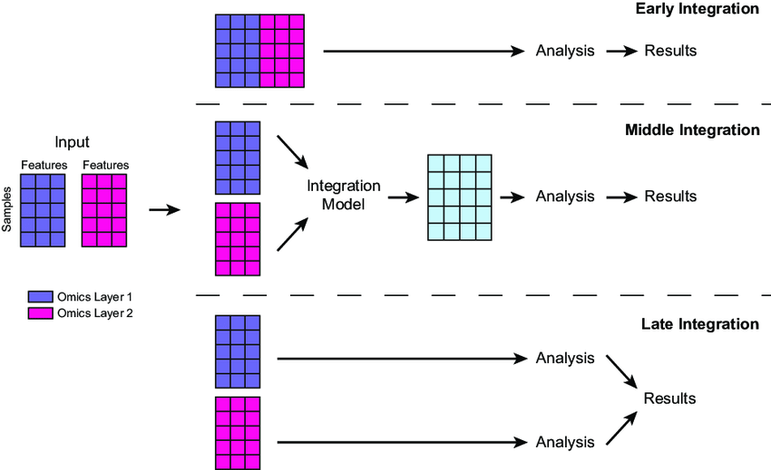

```{r, echo=FALSE}
```

# 1. Introduction to the process of training neural network


# 2. Data Preperation

# 3. Components of a Neural Network

# 4. Neural Network Training Process


Multiomics refers to the integration of multiple biological data types (omics) to study complex diseases.
Disease is influenced by multiple layers (e.g., genetics, environment), and a single data type (e.g., genomics) is insufficient for a complete understanding.
Integrating multidimensional data is essential for deeper insights.

There are different Data Layers:

-   **Genomics**: DNA sequence, e.g., EGFR mutations in lung cancer.
-   **Epigenomics**: Regulation of gene accessibility, e.g., methylation changes in Alzheimer's disease.
-   **Transcriptomics**: RNA expression levels, e.g., altered gene expression in diabetes.
-   **Proteomics**: Protein functions, e.g., inflammatory proteins in rheumatoid arthritis.
-   **Metabolomics**: Cellular metabolic states, e.g., lipid profiles in cardiovascular disease.
-   **Microbiome**: Microbes impacting health, e.g., gut bacteria influencing inflammatory bowel disease.
-   **Exposome**: Environmental factors, e.g., pollutant exposure affecting asthma.
-   **Imaging and Sensors**: Physical monitoring, e.g., wearables tracking heart rate in hypertension.
-   **Social Graph**: Cultural and social influences, e.g., social stress impacting mental health.


# 2. Sources of Multiomics Data

-   **TCGA**: Covers 33 cancer types, 11,000 tumors, offering multilayered data---e.g., used to subtype breast cancer.
-   **CCLE***/***GDSC**: Over 1,000 cancer cell lines tested for drug responses---great for drug screening, but limited by in vitro evolution.
-   **cBioPortal**: Integrates multiomics and clinical data---e.g., visualizing survival trends.
-   **ICGC**: Global collaboration covering 50 cancer types, complementing TCGA with non-Western data---e.g., Asian-specific mutations.
-   **GEO**: Public transcriptomics database, often integrated with TCGA---e.g., for cross-study validation.
-   **DepMap**: Combines CRISPR screening with multiomics---e.g., finding druggable targets.\

**Emerging Trends:**

-   *Single-Cell Multiomics*: Techniques like CITE-seq (RNA + protein) dissect tumor microenvironments
-   *Spatial Omics*: Combines imaging and molecular data to map cellular distributions (e.g., Visium)

# 3. Multiomics Application

Multiomics provides powerful tools to tackle disease by integrating diverse data layers, offering insights into treatment, prognosis, disease mechanisms, and progression.

## 3.1. Precision Medicine

Through multiomics, doctors can deliver the right treatment to the right patient at the right time, based on their unique biological profile.
It creates a more complete picture of a patient's disease, enabling finer stratification, better predictions, and more effective therapies.

-   **Example**: Two EGFR-mutated lung cancer patients might respond differently due to proteomic (e.g., EGFR protein activity) or metabolic (e.g., glutamine reliance) differences detectable by multiomics.
-   **Impact**: Precision medicine moves from "mutation X = drug Y" to "patient X's full profile = therapy Z," capturing variations genomics misses.

## 3.2. Survival

Multiomics predicts how long patients might survive with a given cancer, guiding treatment intensity and follow-up care.

-   **Example**: In breast cancer, combining genomics (e.g., BRCA mutations) with transcriptomics (e.g., RNA expression of survival genes) and proteomics (e.g., apoptosis protein levels) can estimate 5-year survival more accurately than genomics alone.
-   **Impact**: Identifies high-risk patients needing aggressive therapy vs. low-risk ones who might avoid overtreatment, personalizing prognosis.

## 3.3. Subtyping

Multiomics uncovers the potential underlying molecular mechanisms driving a patient's cancer, enabling precise disease classification.

-   **Example**: In prostate cancer, subtyping might reveal high mutation burden (genomics), structural aberrations (e.g., chromosomal rearrangements), or high expression of hormone receptors (transcriptomics), each suggesting different origins---like DNA repair defects or hormonal triggers.
-   **Impact**: Links specific molecular profiles to tailored therapies, e.g., PARP inhibitors for mutation-heavy subtypes or hormone blockers for receptor-driven ones.

## 3.4. Metastasis

Multiomics assesses how likely a tumor is to metastasize to other organs, aiding early intervention and monitoring.

-   **Example**: In melanoma, genomics (e.g., BRAF mutations) paired with proteomics (e.g., adhesion protein loss) and metabolomics (e.g., energy shifts for invasion) predicts metastasis risk to lungs or brain.
-   **Impact**: Highlights patients needing closer surveillance or preventive treatments, like metastasis-blocking drugs, based on multiomics risk scores.

# 4. Multiomics Integration Methods

Multiomics integration methods can be classified into three categories: Early Fusion, Intermediate Fusion, and Late Fusion.
These methods are typically used within machine learning pipelines to combine omics data for analysis.



## 4.1. Early Fusion

-   **How It Works**: Concatenates all raw data from different omics (e.g., gene mutation counts, protein expression values) into a single, wide dataset. This is often done by aligning features (e.g., genes) across layers and stacking them into a matrix---e.g., a table where each row is a patient and columns include genomic, proteomic, etc., values.
-   **Techniques**: Simple concatenation or normalization (e.g., scaling all values to 0-1) to handle differing scales (e.g., mutations as binary vs. protein levels as continuous).
-   **Next Steps**: The combined dataset is typically fed directly into a machine learning model or processed further (e.g., feature selection to reduce noise) before modeling.
-   **Pros**: Simple, captures all possible interactions between layers.
-   **Cons**: Noisy (e.g., irrelevant features), computationally heavy due to high dimensionality.

## 4.2. Intermediate Fusion

-   **How It Works**: Transforms each omics layer into a shared, lower-dimensional representation (e.g., latent factors) before combining them. This uses methods like matrix factorization or neural networks to extract key patterns, then merges these into a unified dataset.
-   **Techniques**: Tools like MOFA (Multi-Omics Factor Analysis) or autoencoders compress genomics (e.g., mutations) and epigenomics (e.g., methylation) into factors capturing shared variation, then concatenate these for analysis.
-   **Example**: MOFA reduces genomics and epigenomics from TCGA into a few key factors (e.g., 10-20 numbers per patient) to subtype tumors, reflecting shared biological signals.
-   **Next Steps**: The fused representation is fed into a neural network or clustering algorithm for tasks like patient stratification.
-   **Pros**: Balances complexity and insight by focusing on meaningful patterns.
-   **Cons**: Requires advanced tools and expertise (e.g., tuning MOFA or training autoencoders).

## 4.3. Late Fusion

-   **How It Works**: Analyzes each omics layer independently first with separate models, then combines their outputs (e.g., predictions or features) at the end. Combination might use averaging, voting, or a secondary model.
-   **Techniques**: Train individual models (e.g., random forests for genomics, SVMs for proteomics), then integrate results via weighted averages or a small neural network.
-   **Example**: "In breast cancer, a random forest on genomics predicts survival risk, an SVM on proteomics assesses protein activity, and their predictions are averaged to estimate overall prognosis."
-   **Next Steps**: Outputs are combined and used for final predictions.
-   **Pros**: Flexible, reduces noise by focusing on layer-specific signals.
-   **Cons**: Misses early cross-layer interactions (e.g., how mutations affect metabolites directly).

# 5. Comparison of Multiomics Integration Methods

Studies comparing multiomics integration methods and neural network models show that no single approach is best for all scenarios, but certain strategies and tools perform better depending on the task, data, and techniques used.
Here's a summary of key findings from recent benchmarks.

## 5.1. Hauptmann and Kramer (Arxiv, 2022) [paper](https://arxiv.org/pdf/2208.14822.pdf)

-   *What They Tested*: Compared 6 tools for multiomics integration: 1.
    Simple Early Integration Classifier, 2.
    Super.FELT, 3.
    MOLI, 4.
    Omics-Stacking, 5.
    OmiEmbed, 6.
    MOMA

-   *Key Findings*:

    -   Early integration (combining all data upfront) performed significantly worse---likely due to noise and high dimensionality.
    -   No tool consistently outperformed others; performance varied by dataset.
    -   Tools using *triplet loss* (a method to train models by comparing data triplets for better separation) generally did better than those that didn't.
    -   OmiEmbed (a supervised Variational Autoencoder) performed worst on holdout (unseen) data, possibly due to overfitting.

## 5.2. Genome Biology Study (2022) [paper](https://genomebiology.biomedcentral.com/articles/10.1186/s13059-022-02739-2)

-   *What They Tested*: Evaluated deep learning methods for multiomics integration in cancer, focusing on:
    -   Integration sequence: Early vs. Late Fusion.
    -   Encoding methods:
        -   Fully Connected Networks (FCNs).
        -   Autoencoders (Basic and Variational).
        -   Loss functions for autoencoders: MMD (Maximum Mean Discrepancy) vs. KL (Kullback-Leibler divergence).
    -   Network architectures:
        -   Graph Attention Network (GAT).
        -   Graph Convolutional Network (GCN).
        -   1D Convolutional Neural Network (CNN).
-   *Key Findings*:
    -   No single approach excelled in all cases---performance depended on the cancer type and task.
    -   Graph Attention Networks (GATs) performed best overall for classification tasks, likely because they model relationships between omics features as a graph.
    -   CNNs (1D) didn't work well, possibly because omics data lacks the spatial patterns CNNs are designed for (e.g., images).
    -   For autoencoders, using MMD loss (which aligns data distributions) often outperformed KL loss (which enforces a specific distribution), improving generalization.


## 5.3. Oxford Review (2022) [paper](https://academic.oup.com/bib/article/23/2/bbab569/6516346?login=true)

-   A comprehensive review analyzed 70 deep learning multiomics papers.


## 5.4. Summary of Trends:

-   Early integration often underperforms due to noise; Late or Intermediate Fusion tends to be more effective.
-   Graph-based methods (e.g., GAT) are promising for classification, while CNNs struggle with omics data.
-   Loss functions matter---triplet loss and MMD can improve model performance over alternatives like KL.
-   Tool choice depends on the task: no one-size-fits-all solution exists.

# References

Article:

-   https://www.researchgate.net/publication/358074725_Machine_learning_for_multi-omics_data_integration_in_cancer
-   https://arxiv.org/pdf/2208.14822
-   https://www.biorxiv.org/content/10.1101/2024.04.03.586404v1.full
-   https://academic.oup.com/bib/article/23/2/bbab569/6516346?login=true

Image:

-   https://www.cell.com/cms/10.1016/j.cell.2014.02.012/asset/7d7ee80d-6b6c-45c7-96b8-615ad93f1c68/main.assets/gr1_lrg.jpg
-   https://www.researchgate.net/publication/358074725/figure/fig2/AS:1124506185809921\@1645114575952/llustration-of-early-middle-and-late-integration-for-merging-data-matrices-generated-by.png
-   https://genomebiology.biomedcentral.com/articles/10.1186/s13059-022-02739-2/figures/1
-   https://academic.oup.com/view-large/338428798


::: {style="display: flex; justify-content: space-between; align-items: center;"}
::: left-align
[Previous](Introduction_of_Multiomics.qmd)
:::

::: right-align
[Next](Drug_Response_Prediction.qmd)
:::
:::

