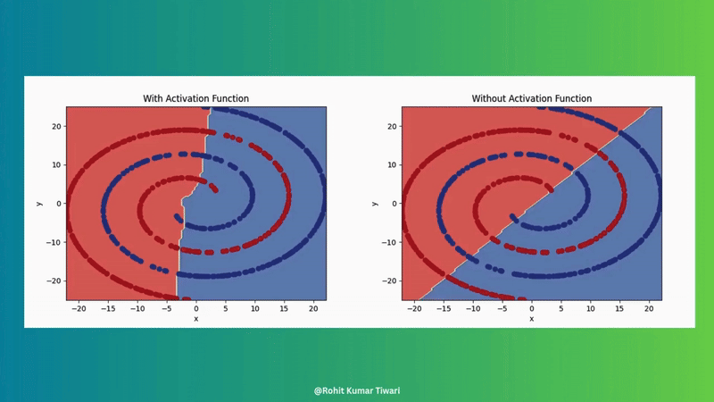

```{r, echo=FALSE}
```

# 1. Introduction to the process of training neural network

In order to train a good nerual network model, you need to do the data preprocessing and understand the struture of the model.
There are several different models available and the struture is slightly different.
Here, we would just focus on the basic component of the neural network model.

# 2. Data Preperation

For any kind of Neural network model, you need to remember that garbage in garbage out.
Raw omics data often contains noise, missing values, and irrelevant features that can degrade model performance.
Proper data preparation ensures that the input data is clean, consistent, and informative, allowing the neural network to learn meaningful patterns effectively.

## 2.1. Data Cleanup

Here is the basic step for you to do the cleanup in Multi-modal omic data:

1.  **Remove Low-Variation Features and Samples**:
    -   Features or samples with very low variation (e.g., constant values across samples) or too many missing values (NAs) are removed.
    -   **Reason**: Low-variation features provide little information for distinguishing between samples, while samples with excessive missing data are unreliable for training.
2.  **Impute Missing Values**:
    -   Remaining missing values (NAs) are imputed using the median value of the feature across samples.
    -   **Reason**: Imputation ensures that the dataset is complete, avoiding the need to discard potentially useful features or samples with a small number of missing values.
3.  **Rank Features Using Laplacian Scores**:
    -   Features are ranked based on their Laplacian Scores, a method that evaluates feature importance by considering relationships between samples in a network structure (not just variance).
    -   **Reason**: Unlike variance-based methods, Laplacian Scores account for the global structure of the data, identifying features that are more likely to be biologically relevant.
4.  **Remove Highly Correlated Features (Optional)**:
    -   Highly correlated features are identified, and the feature with the lower Laplacian Score is removed.
    -   **Reason**: Redundant features add unnecessary complexity to the model without providing additional information, so removing them reduces dimensionality and prevents multicollinearity issues. However, remember to Log Removed Features for potential biological interpretation.
5.  **Select Top Features**:
    -   Retain the top percentile of features (normally 20%) based on Laplacian Scores.
    -   **Reason**: Focusing on the most informative features reduces the dimensionality of the data (mitigating the curse of dimensionality) and ensures the model learns from the most relevant signals.

**Additional Notes**:

-   **Biological Context**: High-variance features may not always be meaningful (e.g., non-coding RNAs might show high variance due to noise). Laplacian Scores help mitigate this by focusing on sample relationships rather than just variance.
-   **Batch Effects**: High variance in omics data may stem from batch effects (systematic biases). Applying batch correction before cleanup can address this issue.


## 2.2. Harmonize Training and Testing Datasets

After the data cleanup, the dataset need to be seprate into training group and testing group.
In \[Note 1: Supervising Learning\](module1/supervised.html) section 3, you could see how to seperate dataset.
In addition to the seperation, the training and testing datasets must be consistent in terms of features and scaling to ensure fair evaluation.
If the training and testing datasets have different feature sets or scaling, the model may fail to generalize.
This step is critical for reliable model evaluation and for ensuring that predictions are meaningful in a clinical context.

Followings are the common steps of Harmonizing:

1.  **Feature Intersection** :

    -   Ensure that the training and testing datasets share the same features by taking the intersection of their feature sets.

    -   Example: If the training data includes Genes A, B, C, D, E, but the testing data only has Genes A, B, C, the model uses only Genes A, B, C for both datasets.

    -   **Reason**: Using different feature sets for training and testing would make the model incompatible with the testing data, leading to poor performance and unreliable predictions.

2.  **Standardization**:

    -   Compute scaling factors (mean and standard deviation) from the training data only.

    -   Apply these scaling factors to both the training and testing data to standardize them (e.g., subtract the mean and divide by the standard deviation).

    -   **Reason**: Standardizing ensures that features are on the same scale, which is essential for neural networks to learn effectively.
        Using training data to compute scaling factors prevents data leakage, as the testing data remains unseen during this process.

3.  **Transform Testing Data**:

    -   The testing data is transformed by using the scaling factors (Mean and standard deviation) learned from the training data in Standardization step.

    -   **Reason**: Using the training data's scaling factors ensures that the testing data is processed in the same way as the training data, maintaining consistency in scale and distribution.
        This mimics real-world scenarios where the model only has access to training data during training and must apply learned parameters to new, unseen data.

    -   **Example**:

        -   Training data for a feature (e.g., Gene A): \[10, 20, 30, 40, 50\].

            -   Mean = 30, Standard Deviation ≈ 14.14.

            -   Standardized training data: \[-1.41, -0.71, 0, 0.71, 1.41\].

        -   Testing data for the same feature: \[15, 45\].

            -   Using training data's ( Mean = 30) and ( Standard Deviation = 14.14), standardize the testing data:

                -   15 → ((15 - 30) / 14.14 ≈ -1.06)

                -   45 → ((45 - 30) / 14.14 ≈ 1.06)

            -   Standardized testing data: \[-1.06, 1.06\].

        -   Both datasets are now on the same scale, ensuring the model can process them consistently.

-   **Additional Notes**:

    -   **Avoiding Data Leakage**: Standardizing both datasets using parameters from the training data ensures that the model does not inadvertently learn from the testing data, which would inflate performance metrics and lead to overly optimistic results.

    -   **Feature Consistency**: The feature intersection is crucial for multi-modal data, as different modalities (e.g., gene expression, mutations) may have varying feature availability across datasets.

    -   **Practical Tip**: When working with biological data, always verify that the features retained after intersection are biologically relevant to the task (e.g., cancer-related genes for oncology applications).


# 3. Components of a Neural Network

There are several different kinds of Neural Network Structure.
Here, I will introduce a basic structure and Key Components of Neural Network.
And this is the video about the background of the neural network.

::: {style="display: flex; justify-content: center; align-items: center; width: 100%;"}
::: {style="max-width: 560px;"}
<iframe width="560" height="315" src="https://www.youtube.com/embed/aircAruvnKk" title="What is a Neural Network" frameborder="0" allow="accelerometer; autoplay; clipboard-write; encrypted-media; gyroscope; picture-in-picture" allowfullscreen>

</iframe>
:::
:::

## 3.1. Basic Structure


1.  **Input Layer**:
    -   Receives raw data (e.g., features like gene expression values).

    -   Number of nodes equals the number of input features.
2.  **Hidden Layers**:
    -   Process the input data through weighted connections and activation functions.

    -   Number of hidden layers and nodes per layer are hyperparameters to be tuned.
3.  **Output Layer**:
    -   Produces the final prediction.

    -   Number of nodes depends on the task (e.g., 1 node for binary classification, multiple nodes for multi-class classification).

## 3.2. Key Components

### Neurons/Nodes

Basic units that receive inputs, apply weights, and pass the result through an activation function.

### Weights

Parameters that determine the importance of each input, adjusted during training.

### Activation Functions

Introduce non-linearity (e.g., ReLU, sigmoid) to allow the network to learn complex patterns.
Without this, neural networks couldn't make the magic.
[Example1](https://towardsai.net/p/machine-learning/introduction-to-neural-networks-and-their-key-elements-part-c-activation-functions-layers-ea8c915a9d9), [Article](https://www.analyticssteps.com/blogs/7-types-activation-functions-neural-network)




### Loss Functions

Loss functions measure the difference between model predictions and actual values, guiding optimization in machine learning.

Below is a comprehensive table of common loss functions, categorized by task type for easy reference.


::: {style="display: flex; gap: 20px; align-items: center;"}
<iframe width="560" height="315" src="https://www.youtube.com/embed/v_ueBW_5dLg" title="Loss Function Explanation" frameborder="0" allow="accelerometer; autoplay; clipboard-write; encrypted-media; gyroscope; picture-in-picture" allowfullscreen>

</iframe>

<iframe width="560" height="315" src="https://www.youtube.com/embed/IVVVjBSk9N0" title="Neural Network Basics" frameborder="0" allow="accelerometer; autoplay; clipboard-write; encrypted-media; gyroscope; picture-in-picture" allowfullscreen>

</iframe>
:::

### Optimizer

-   **Why This Is Necessary**: In neural network training, the model generates predictions via forward propagation and computes the error using a loss function.
    To minimize this error, the model's parameters (weights and biases) need to be adjusted.
    However, finding the optimal solution in a high-dimensional, complex loss function is challenging without a systematic approach.
    The optimizer provides a method to iteratively update parameters based on gradients, ensuring efficient convergence to a minimum loss.

-   **What It Achieves**: The optimizer enables the model to efficiently and stably converge to a low-loss state, improving prediction accuracy.
    Different optimizers adapt to various data characteristics and network architectures, helping to overcome issues like slow convergence, instability due to high learning rates, or getting trapped in local minima.

-   **Common Types**:

    -   **Stochastic Gradient Descent (SGD)**: Updates parameters using gradients from a single sample or small batch, simple but may converge slowly or oscillate.
    -   **Momentum**: Adds a momentum term to SGD, accelerating updates and helping escape local minima.
    -   **Adam (Adaptive Moment Estimation)**: Combines momentum and RMSProp, adaptively adjusts learning rates, widely used for its fast and stable convergence.
    -   **RMSProp**: Adjusts learning rates based on the moving average of squared gradients, suitable for non-stationary objective functions.
    -   **Notes**: The choice of optimizer and its hyperparameters (e.g., learning rate) is often tuned via hyperparameter optimization (HPO) to suit specific tasks.

### Gradient Descent

Gradient descent is an optimization algorithm used to find the optimal solution (usually the global minimum) of a loss function by updating the weight in the opposite direction of the gradient to gradually reduce the loss.
Step size is determined by the learning rate.
[Article](https://pub.towardsai.net/deep-learning-from-scratch-in-modern-c-gradient-descent-670bc5889112)

**Life-like Analogy**: Descending a Mountain to Find the Lowest Point Imagine you are on a topographic map with many valleys (the landscape of the loss function), and your goal is to find the lowest valley (the minimum loss).
You are standing at a random starting point (initial weights), but you cannot see the entire landscape, only feel the slope under your feet (the gradient).
Gradient descent is like taking steps downwards based on the slope (gradient):

If the slope tilts to the left (the gradient is positive), you move to the right (the opposite direction).
If the slope tilts to the right (the gradient is negative), you move to the left (the opposite direction).
You take a step each time (update the weights) until you reach a low point (minimum loss).


### Learning Rate

Step size for weight updates.
Here are some articles about how to set up the learning rate: [Article 1](https://medium.com/@ompramod9921/mastering-gradient-descent-optimizing-neural-networks-with-precision-e461e996633e), [Article 2](https://www.jeremyjordan.me/nn-learning-rate/)


### Batch Size

Number of samples processed before updating weights.


### Epochs

Number of complete passes through the training data.

(Here is the article explain what is Batch Size, Epochs, and iterations. [Article](https://www.sabrepc.com/blog/Deep-Learning-and-AI/Epochs-Batch-Size-Iterations))

# 4. Neural Network Training Process


The training process of a neural network could mainly divide into three stages:

1.  **Forward Propagation**: Data flows from input to output, generating predictions.
2.  **Loss Calculation**: Compares predicted values with actual values, calculating the error.
3.  **Backward Propagation**: Adjusts the network's weights based on the error, optimizing the model.

These three stages are repeated multiple times until the error (loss) becomes very small.

# 5. Model Evaluation

In order to evaluate the performance of the neural network, there are several plots you can see.


# 6. Model Performance Enhancement

There are also several ways to improve the performance of the model.
Each optimization methods would fit different scenarios and most of the time those method needs to use together to have a best result.


In this note, we would meaning focusing on the Hyperparameter Fine-Tuning.

## 6.1. Hyperparameter Fine-Tuning

In machine learning and deep learning, hyperparameters are parameters that must be set manually before the model training process begins.

These hyperparameters can significantly impact the model's performance and are associated with various components of the neural network.
Common types of hyperparameters include:

-   **Model Architecture Parameters**: Such as the number of layers, the number of units (neurons) per layer, and the size of convolutional filters in a convolutional neural network (CNN).
-   **Training Process Parameters**: Such as the learning rate, batch size, and the choice of optimizer (e.g., SGD, Adam).
-   **Regularization Parameters**: Such as the L2 regularization coefficient and the dropout rate, which help prevent overfitting.

To achieve the best performance, we need to find the optimal settings for these hyperparameters.
There are three common methods for hyperparameter tuning: Grid Search, Random Grid Search, and Bayesian Optimization.
Compared to traditional methods like Grid Search and Random Grid Search, Bayesian Optimization is more efficient because it leverages the results of previous trials to guide subsequent searches, rather than exhaustively or randomly trying all possible combinations.

Related [Article](https://www.sciencedirect.com/science/article/pii/S0169743922000314#fig3)


## 6.2. Bayesian Hyperparameter Fine-Tuning

Bayesian optimization works through the following two core components:

-   **Surrogate Model:**
    -   The surrogate model typically uses a Gaussian Process (GP) to approximate the objective function, which represents the relationship between hyperparameter combinations and model performance.
    -   The surrogate model predicts the performance of different hyperparameter combinations and provides uncertainty estimates.
-   **Acquisition Function:**
    -   The acquisition function determines the hyperparameter combination for the next trial, balancing Exploration and Exploitation:
        -   Exploration: Focusing on areas with high uncertainty, which may potentially yield high performance
        -   Exploitation: Choosing the area predicted to have the best performance.
    -   Common acquisition functions include Expected Improvement (EI), Probability of Improvement (PI), and Upper Confidence Bound (UCB).

The process of Bayesian optimization:

1.  **Initialization**: Randomly select several hyperparameter combinations, train the model with each combination, and record the performance (e.g., validation accuracy or loss).
2.  **Modeling**: Use a Gaussian Process (or another surrogate model) to fit the relationship between hyperparameters and performance, creating a surrogate function.
3.  **Select the Next Hyperparameter Set**: Use the acquisition function to identify the hyperparameter combination most likely to improve performance, and select it for the next trial.
4.  **Update**: Incorporate the results of the new trial into the surrogate model, and repeat steps 2--3 until a stopping criterion is met (e.g., a maximum number of trials is reached or performance converges).

Bayesian Optimization is particularly effective for continuous hyperparameters, such as learning rate and dropout rate, because the Gaussian Process assumes a smooth relationship between hyperparameters and performance.
For discrete hyperparameters (e.g., number of layers or units) or categorical hyperparameters (e.g., optimizer type), Bayesian Optimization can still be applied by using appropriate surrogate models (e.g., tree-based models) or by mapping discrete values to a continuous space during optimization.

# References

Article:

-   https://towardsai.net/p/machine-learning/introduction-to-neural-networks-and-their-key-elements-part-c-activation-functions-layers-ea8c915a9d9
-   https://wandb.ai/mostafaibrahim17/ml-articles/reports/Decoding-Backpropagation-and-Its-Role-in-Neural-Network-Learning\--Vmlldzo3MTY5MzM1
-   https://tamaszilagyi.com/blog/2017/2017-11-11-animated_net/
-   https://pub.towardsai.net/deep-learning-from-scratch-in-modern-c-gradient-descent-670bc5889112
-   https://medium.com/\@ompramod9921/mastering-gradient-descent-optimizing-neural-networks-with-precision-e461e996633e
-   https://www.jeremyjordan.me/nn-learning-rate/
-   https://awesomeneuron.substack.com/p/activation-functions-the-secret-sauce
-   https://www.sabrepc.com/blog/Deep-Learning-and-AI/Epochs-Batch-Size-Iterations
-   https://www.sciencedirect.com/science/article/pii/S0169743922000314

Image:

-   https://i2.wp.com/cdn-images-1.medium.com/max/550/1\*pO5X2c28F1ysJhwnmPsy3Q.gif?s sl=1&w=800&resize=800&ssl=1
-   https://www.youtube.com/watch?v =1npWKwGaq9Q&ab_channel=AwesomeNeuron
-   https://miro.medium.com/v2/resize:fit:720/format:webp/1\*Nq6UMjR0WyH0Q8sDYmSzaQ.gif
-   https://ars.els-cdn.com/content/image/1-s2.0-S0169743922000314-gr2.jpg

::: {style="display: flex; justify-content: space-between; align-items: center;"}
::: left-align
[Previous](Introduction_of_Multiomics.qmd)
:::

::: right-align
[Next](Drug_Response_Prediction.qmd)
:::
:::
